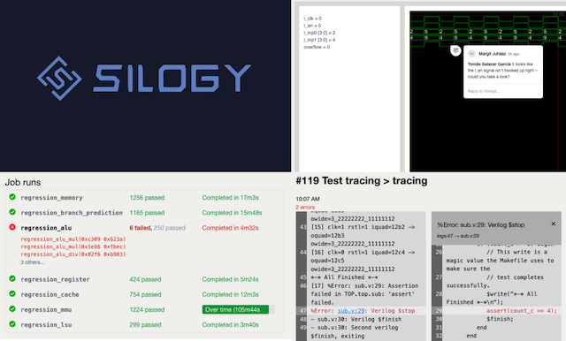

SiLogy example repository
===

SiLogy is a cloud tool for chip design and verification. We provide a platform for design verification engineers to
orchestrate test runs, get test results, and collaborate with colleagues. This repository is intended to show you some
things you can do with SiLogy. 

Get started
---

1. Clone this repository into your own account (all branches, not just main).
2. Install our [app](https://github.com/apps/silogy-design-verification-runner) on your account, enabled for just the
   new cloned repo.
3. Click "Run" on the homepage or push to your cloned repo to kick off a test.
4. To modify the compilation steps that are run pre-test, click on the repo name -> "See base definitions" -> "Example
   base definition" -> modify the pre-clone or post-clone Dockerfile steps.

Test definitions
---

The file [`silogy.yml`](/silogy.yml) defines how SiLogy runs your tests.

The `test_targets` key defines which tests can run. By default, when you push to a branch, every single test target is
run. We're working on configuration to trigger specific tests on specific branches. Each target has a `time_limit`
defining the time limit for the test in seconds.

Each target in `test_targets` must have a `test_rule` that matches a key in `test_rules`. Each rule in `test_rules`
contains a `command_string` key. This command string is a Jinja template. Jinja templates support variable substitution
as well as some basic logic.

Command strings may be written to accept args which can be provided by each individual test target, or when manually 
triggering tests in the UI. To see examples of this, check out the `spi` and `vga` branches. For an example of a failing
test, check out `spi-bug`.
